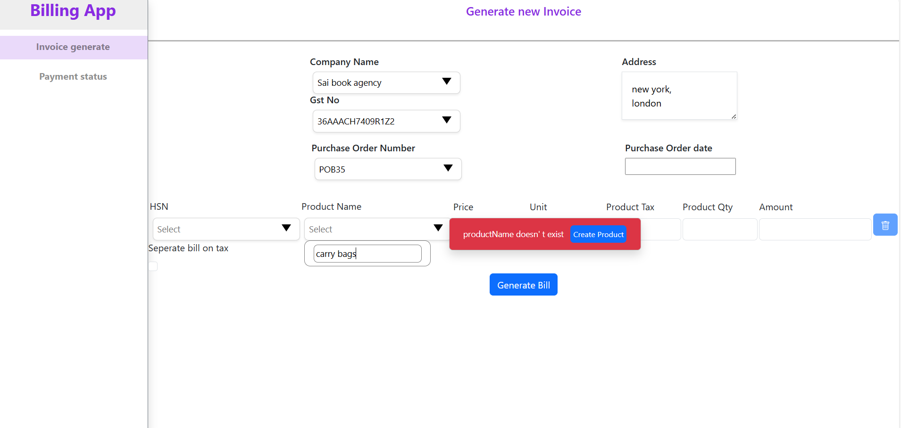
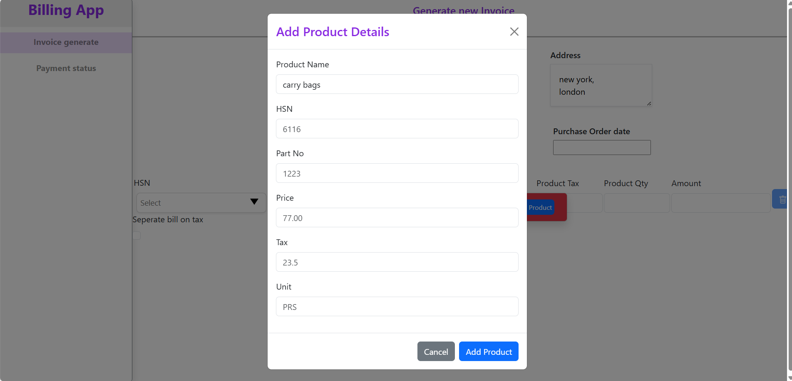
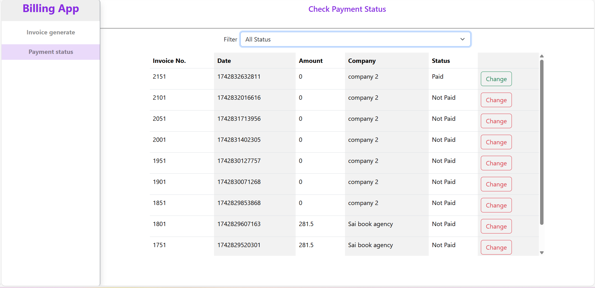
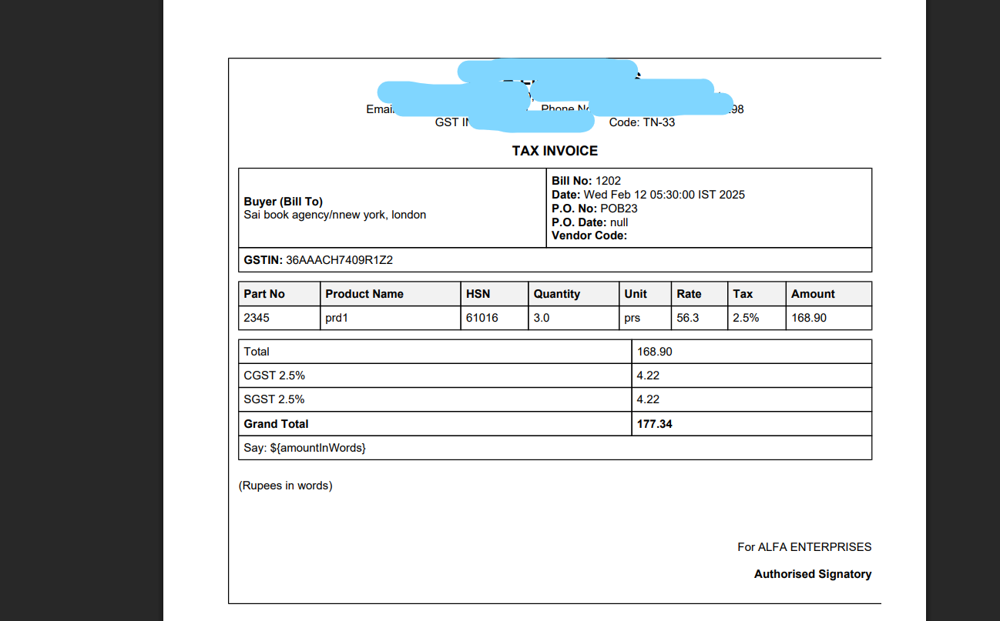

# Billing System

## Description  
A web application for managing companies, tracking their purchase orders, mapping products with company-specific pricing, and generating invoices.

## Tech Stack  
1. **Backend**: Spring Boot, Spring Data JPA, SQL  
2. **Frontend**: React.js, Redux Toolkit  
3. **Miscellaneous**: AOP, DTO, Factory Design Pattern, Transaction Management  

## Features  

### a. User-friendly UI for easy addition of product/company/purchase order numbers similar to this  
  
  

### b. Check status  
  

### c. Generating PDF invoice  
- Utilized **OpenPDF** to convert an existing HTML template to a PDF.  
- Saving the PDF location in the database considering the **database performance** and **faster retrieval of files**.  
  

### d. Transaction Management  
- Implemented **transaction management** while an exception occurs in invoice generation.  
- Used **Aspect-Oriented Programming (AOP)** to rollback file generated.  

### e. Adhered to **Data Transfer Objects (DTO)** concept, reducing sensitive data exposure.  

### f. Explored creating **continuous and unique invoiceNo** (with significantly fewer gaps, since gaps in invoices can cause legal trouble).  

#### **1. Primary key guarantees uniqueness but not continuity**  

#### Problems faced while using generator sequence to rollback primary key:  
1. Not able to get the same **transaction manager thread**, hence considered a separate transaction and `@Transactional` doesn't rollback.  

2. **Generated IDs are usually incremented outside the transaction**, or else could create redundant primary keys:  

To solve this, we have to **block all other transactions** that need to insert new rows.  

#### **2. Solution came up with:**  
- Have `invoiceId` as the primary key for the `invoiceId` table.  

##### **Table: `invoice_no`**  
| userId | invoiceId | invoiceNo (unique, nullable) | set/notSet |
|--------|----------|------------------------------|------------|
| 123    | 1001     | NULL                         | Not Set    |

- **Lock the invoice_id for userId record alone** with **pessimistic lock**.  
- **Update invoiceNo only after all steps in invoice DB**, so that exception in other steps doesn't require rollback of invoice number.  
- **Update invoiceNo to `MAX(invoiceNo) + 1`**.  
